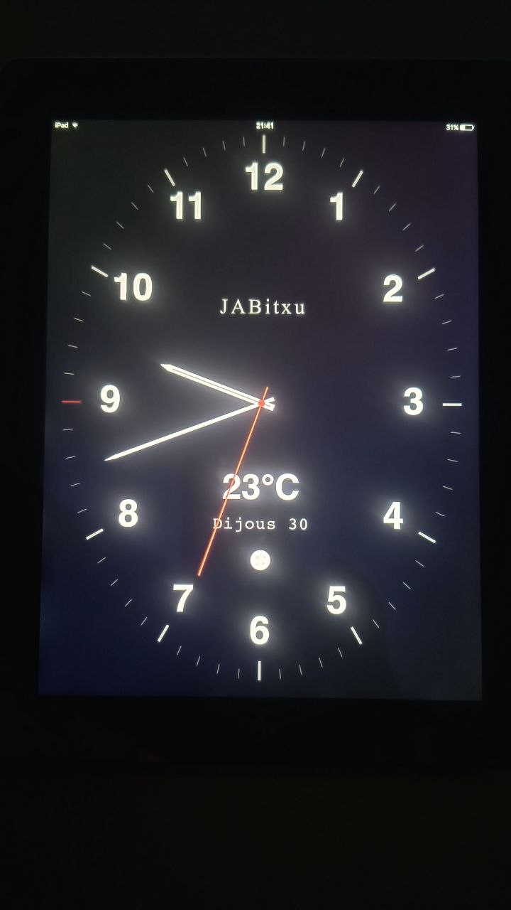

# JABitxu Clock (v13) 
## JABAnalogClockRectangular8_v13.20260730

Aplicació Web Progressiva (PWA) de rellotge analògic personalitzat, dissenyada específicament per a pantalles iPad en orientació horitzontal i vertical.

---

## 📱 Captura de Pantalla / Vista Prèvia

*Exemple del rellotge en funcionament en un iPad (Mode Vertical).*

---

## 🚀 Característiques Principals

* **Disseny Adaptatiu (Responsive):** Reorganitza automàticament els elements en mode Horitzontal (`viewBox="-666.5 -500 1333 1000"`) o Vertical (`viewBox="-500 -666.5 1000 1333"`).
* **Fase Lunar Astronòmica amb Cràters:** Càlcul automàtic de la fase lunar en temps real segons la data del calendari julià, amb detalls subtils de cràters i ombra de fase dinàmica.
* **Informació Meteorològica Integrada:** Previsió de temperatura en temps real per a Seva (Osona) mitjançant l'API d'Open-Meteo, amb codificació de colors segons el rang tèrmic.
* **Gestió Intel·ligent de Brillantor (Mode Nit/Dia):**
  * **Mode Dia (06:00h - 00:00h):** Brillantor ajustada al **60%** (`0.60`) per a una visualització confortable i elegant en interiors.
  * **Mode Nit (00:00h - 06:00h):** Atenuació automàtica al **20%** (`0.20`) d'opacitat per evitar molèsties a la foscor.
  * **Sense Alteració de Colors:** Els colors originals de les agulles, números i fons es mantenen 100% fidels les 24 hores del dia.
  * **Control Tàctil:** Permet ajustar la brillantor manualment fent gliscar un dit verticalment per la pantalla (`touchmove`).
* **Suport Offline (PWA / Service Worker):** Memòria cau d'actius (`v13`) per funcionar de manera fluida com a aplicació independent d'iOS/iPadOS sense barra de navegació.

---

## 📁 Estructura del Projecte

| Fitxer | Descripció |
| :--- | :--- |
| `index.html` | Estructura principal en SVG vectorial i configuració PWA per a iPadOS. |
| `css/style.css` | Estils visuals, escalat de text, fonts i colors de temperatura. |
| `js/clock.js` | Lògica contínua del rellotge, càlcul astronòmic lunar, API temps i gestió de brillantor. |
| `js/sw.js` | Service Worker amb gestió de memòria cau versió `v13`. |
| `img/icona-ipad.png` | Icona de l'aplicació per a la pantalla d'inici d'iPad. |
| `img/JABAnalogClockRectangular8_v13.20260730.jpeg` | Imatge d'exemple d'execució real a l'iPad. |

---

## 📋 Historial de Versions

* **`v13`**: Ajust de brillantor automàtica (**60% Dia** / **20% Nit**) de 00:00h a 06:00h sense cap alteració de colors.
* **`v12`**: Eliminació del mode de color vermell nocturn; manteniment dels colors originals mitjançant control d'opacitat.
* **`v11`**: Correcció de la posició vertical i horitzontal de la Lluna situant-la a sota de la data.
* **`v10`**: Reorganització d'elements visuals: Marca (dalt), Temperatura, Data i Lluna.
* **`v9`**: Incorporació de detall de cràters subtils a la superfície lunar.
